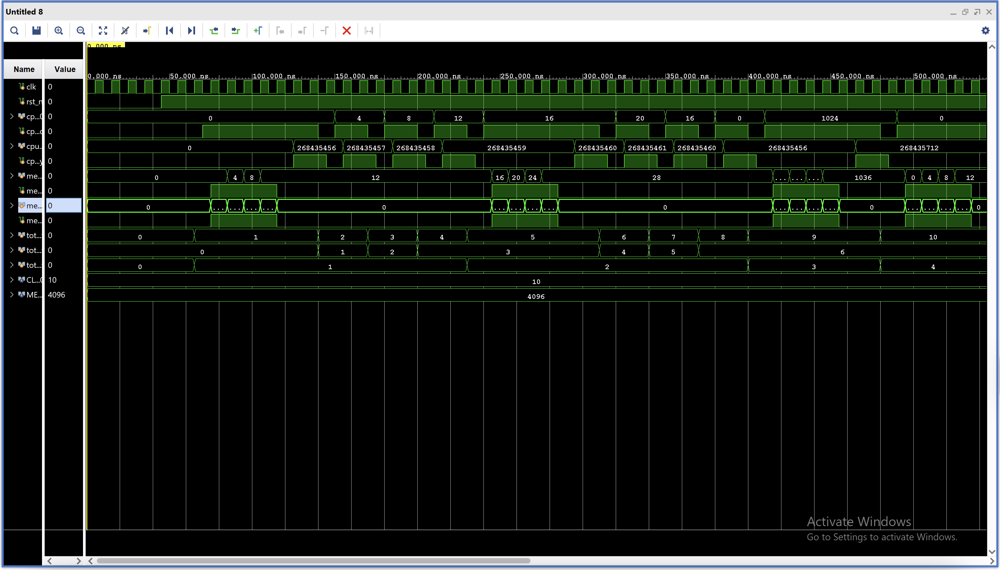
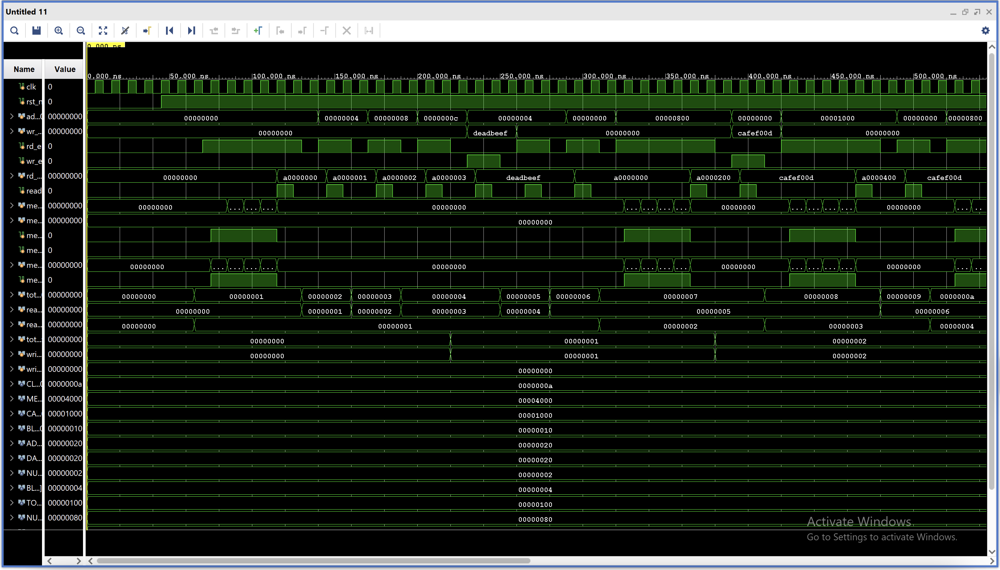

# L1 Caches (D-caches and I-caches)

## Configuration Summary

| Feature | I-Cache | D-Cache |
| --- | --- | --- |
| Size | 1 kB | 4 kB |
| Block Size | Row 2 Col 2 | Row 2 Col 3 |
| Associativity | Direct-Mapped | 2-way Set Associative |
| Write Policy | N/A | Write-Back / Dirty Bits |
| Replacement | N/A | 1-bit LRU |

---

<p align="center">
    
</p>

*Image source: [CS Illustrated: Cache Associativity](https://csillustrated.berkeley.edu/PDFs/handouts/cache-3-associativity-handout.pdf), UC Berkeley Computer Science Department*


## Purpose

Caches act as fast memory access for the CPU, lowering CPI and increasing overall CPU performance. For the purposes of this single core processor with external peripherals, I implemented two separate L1 caches for the instruction memory and data memory modules.

---

## Different Cache Archetypes

1. Direct Mapped Cache (1-way Set Associative)

A direct-mapped cache is the simplest organization: one cache line per index, no replacement policy needed. The tradeoff is higher conflict misses, since multiple memory blocks can map to the same index. Direct-mapped caches work well when the workload exhibits strong locality—especially instruction streams where sequential addresses fall within the same cache line (different word offsets).

2. N-way Set Associative

Unlike a direct mapped cache, each cache line in an N-way set associative cache will have N ways. You can think of each cache line as a set, with a defined size for how many words can go in it. For a direct mapped cache, the size of each set is always 1, making it highly prone to cache conflicts if another address maps exactly to the same cache line. 

3. Fully Set Associative

Fully associative is the other end of the spectrum from direct-mapped. Any memory block can be placed in any cache line; there is no index field in the address at all. The entire tag is compared against every cache line simultaneously using parallel comparators, so a lookup requires checking all N lines at once. This eliminates conflict misses entirely: two addresses can never evict each other simply because they share an index, since there is no index. The only misses that remain are cold misses (first access to a block) and capacity misses (the cache is genuinely full).

The tradeoff is hardware cost. Parallel tag comparison across all lines requires N comparators running simultaneously, and the replacement policy (typically LRU or a pseudo-LRU approximation) becomes significantly more complex as N grows.

---

## Design Decision

In any sort of cache design, you have to consider trade-offs in how you want to go about your design. In many modern CPU systems, DRAM latency is orders of magnitude larger than a CPU cycle, so a cache miss can cost hundreds of core cycles. Cache performance is often discussed in terms of three levers:

* Reduce miss rate (fewer misses): larger caches, higher associativity, better replacement, better locality.

* Reduce miss penalty (cheaper misses): faster lower memory, wider interfaces, critical-word-first / early restart (in more advanced designs).

* Hide latency (misses still happen, but hurt less): prefetching, non-blocking caches (MSHRs), out-of-order execution, multithreading.

The right choice depends on workload and constraints—area, timing/critical path, and design complexity.

These are just some ways of going about it, each with its own drawbacks. The specific choice of implementation depends on whether you can afford that extra hardware for increased performance, or whether a 10% reduction in cache misses is worth
the extra delays in your CPU's critical path. These are just some questions to think about.

The instruction cache is implemented as direct-mapped to minimize critical path delay and hardware complexity. Given that instruction streams generally exhibit strong spatial locality and sequential execution, the increased associativity was not deemed necessary for this embedded-class core.

For the data cache, a 2-way set associative cache was the architecture of choice. This is because data access is a lot more sporadic and less predictable than instructions, so having increased ways to reduce conflict misses was much more worth it than for the instruction pipeline.

---

## Simulation + Waveform

Here's the waveform and text output for the instruction cache simulation:

<p align="center">
    
</p>

```
# run 1000ns

========== TEST 1: cold miss then hits within same line ==========
[ACCESS] addr=00000000  MISS  wait_cycles=7  data=10000000  time=140000
[ACCESS] addr=00000004  HIT   wait_cycles=2  data=10000001  time=170000
[ACCESS] addr=00000008  HIT   wait_cycles=2  data=10000002  time=200000
[ACCESS] addr=0000000c  HIT   wait_cycles=2  data=10000003  time=230000

========== TEST 2: new line, then re-access ==========
[ACCESS] addr=00000010  MISS  wait_cycles=7  data=10000004  time=310000
[ACCESS] addr=00000014  HIT   wait_cycles=2  data=10000005  time=340000
[ACCESS] addr=00000010  HIT   wait_cycles=2  data=10000004  time=370000

========== TEST 3: conflict-style access ==========
[ACCESS] addr=00000000  HIT   wait_cycles=2  data=10000000  time=400000
[ACCESS] addr=00000400  MISS  wait_cycles=7  data=10000100  time=480000
[ACCESS] addr=00000000  MISS  wait_cycles=7  data=10000000  time=560000
[ACCESS] addr=00000400  MISS  wait_cycles=7  data=10000100  time=640000

========== TEST 4: sequential workload ==========
[ACCESS] addr=00001000  MISS  wait_cycles=7  data=10000400  time=720000
[ACCESS] addr=00001004  HIT   wait_cycles=2  data=10000401  time=750000
[ACCESS] addr=00001008  HIT   wait_cycles=2  data=10000402  time=780000
[ACCESS] addr=0000100c  HIT   wait_cycles=2  data=10000403  time=810000
[ACCESS] addr=00001010  MISS  wait_cycles=7  data=10000404  time=890000
[ACCESS] addr=00001014  HIT   wait_cycles=2  data=10000405  time=920000
[ACCESS] addr=00001018  HIT   wait_cycles=2  data=10000406  time=950000
[ACCESS] addr=0000101c  HIT   wait_cycles=2  data=10000407  time=980000
xsim: Time (s): cpu = 00:00:08 ; elapsed = 00:00:11 . Memory (MB): peak = 1366.289 ; gain = 0.000
INFO: [USF-XSim-96] XSim completed. Design snapshot 'instr_cache_tb_behav' loaded.
INFO: [USF-XSim-97] XSim simulation ran for 1000ns
launch_simulation: Time (s): cpu = 00:00:11 ; elapsed = 00:00:28 . Memory (MB): peak = 1366.289 ; gain = 0.000
```

Here's the waveform and text output for the data cache simulation:

<p align="center">
    
</p>

```
# run 1000ns

========== TEST 1: cold read miss then hits in same block ==========
[READ ] addr=00000000  MISS  wait=6  data=a0000000  set=0  tag=0  time=130000
[READ ] addr=00000004  HIT   wait=2  data=a0000001  set=0  tag=0  time=160000
[READ ] addr=00000008  HIT   wait=2  data=a0000002  set=0  tag=0  time=190000
[READ ] addr=0000000c  HIT   wait=2  data=a0000003  set=0  tag=0  time=220000

========== TEST 2: write hit then read back ==========
[WRITE] addr=00000004  HIT   wait=2  wdata=deadbeef  set=0  tag=0  time=250000
[READ ] addr=00000004  HIT   wait=2  data=deadbeef  set=0  tag=0  time=280000
Write-back check PASSED: backing_mem[1] = a0000001 (unchanged)

========== TEST 3: fill both ways of same set ==========
[READ ] addr=00000000  HIT   wait=2  data=a0000000  set=0  tag=0  time=310000
[READ ] addr=00000800  MISS  wait=6  data=a0000200  set=0  tag=1  time=380000

========== TEST 4: force dirty eviction / write-back ==========
[WRITE] addr=00000000  HIT   wait=2  wdata=cafef00d  set=0  tag=0  time=410000
[READ ] addr=00001000  MISS  wait=6  data=a0000400  set=0  tag=2  time=480000
Post-eviction: backing_mem[0x0000_0000>>2] = a0000000
Way 0 was not the eviction victim (LRU chose differently - ok).

========== TEST 5: read back all three competing lines ==========
[READ ] addr=00000000  HIT   wait=2  data=cafef00d  set=0  tag=0  time=510000
[READ ] addr=00000800  MISS  wait=6  data=a0000200  set=0  tag=1  time=580000
[READ ] addr=00001000  MISS  wait=10  data=a0000400  set=0  tag=2  time=690000

========== TEST 6: sequential streaming (4 cache lines) ==========
[READ ] addr=00002000  MISS  wait=6  data=a0000800  set=0  tag=4  time=760000
[READ ] addr=00002004  HIT   wait=2  data=a0000801  set=0  tag=4  time=790000
[READ ] addr=00002008  HIT   wait=2  data=a0000802  set=0  tag=4  time=820000
[READ ] addr=0000200c  HIT   wait=2  data=a0000803  set=0  tag=4  time=850000
[READ ] addr=00002010  MISS  wait=6  data=a0000804  set=1  tag=4  time=920000
[READ ] addr=00002014  HIT   wait=2  data=a0000805  set=1  tag=4  time=950000
[READ ] addr=00002018  HIT   wait=2  data=a0000806  set=1  tag=4  time=980000
xsim: Time (s): cpu = 00:00:09 ; elapsed = 00:00:13 . Memory (MB): peak = 1374.258 ; gain = 0.000
INFO: [USF-XSim-96] XSim completed. Design snapshot 'data_cache_tb_behav' loaded.
INFO: [USF-XSim-97] XSim simulation ran for 1000ns
launch_simulation: Time (s): cpu = 00:00:12 ; elapsed = 00:00:30 . Memory (MB): peak = 1374.258 ; gain = 0.000
```

---

## References

[1] E. Ren, "Cache associativity," CS Illustrated, University of California, Berkeley, 
    Berkeley, CA, USA. [Online]. Available: 
    https://csillustrated.berkeley.edu/PDFs/handouts/cache-3-associativity-handout.pdf

---