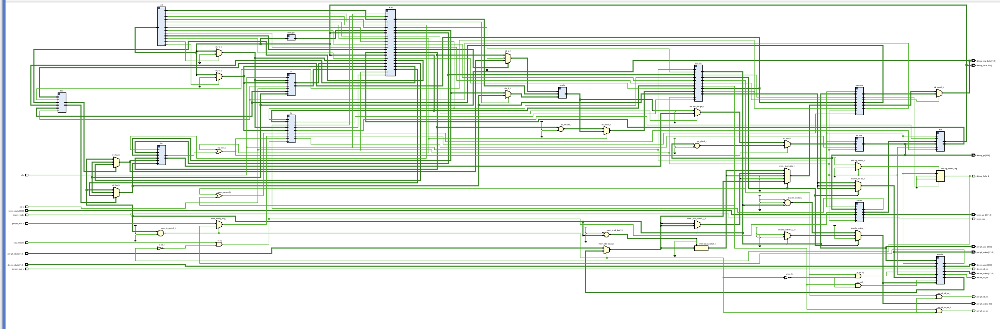

# Static Timing Analysis

My setup for running STA against the SkyWater Sky130 (130nm) open PDK — OpenSTA for the
timing, Volare to grab the PDK Liberty files. Writing it down so I don't have to re-figure
out the Docker/PDK setup every time.

I ran both the cached and cacheless cores so I could compare them. The cacheless one
(`core_riscv_cacheless`) is the design I'm actually synthesizing to hardware; the cached run
is what convinced me to drop the caches in the first place. Both results are below.

---

## Getting OpenSTA running (Docker)

No Homebrew formula, and building from source on Mac means fighting Xcode's Tcl/Flex/Bison
versions, so Docker was easier.

Heads up: `openroad/opensta` has no arm64 build, so on Apple Silicon it needs amd64 emulation
or it fails with `no matching manifest for linux/arm64/v8`. Docker Desktop also has to be
running, not just installed — `open -a Docker` if it isn't.

```bash
docker pull openroad/opensta
docker run --platform linux/amd64 -it -v $(pwd):/data openroad/opensta
```

`-v $(pwd):/data` mounts the current folder so the netlist, SDC, and Liberty are visible
inside. Drops into OpenSTA's Tcl prompt (`%`). To get out: `exit`, not `quit`.

## Getting the Sky130 PDK (Volare)

Didn't want to build `open_pdks` from source — multi-hour build for stuff I don't need.

```bash
pip install volare --break-system-packages
volare enable --pdk sky130 $(volare ls-remote --pdk sky130 | head -1)
cp "$(find ~/.volare -name 'sky130_fd_sc_hd__tt_025C_1v80.lib' | head -1)" .
```

`sky130_fd_sc_hd` is the high-density cell library, `tt_025C_1v80` the typical corner
(25°C, 1.8V). The `ss_`/`ff_` corners sit next to it for worst-case setup / best-case hold.

## Synthesis + STA flow

Both designs use the same flow, just different top modules. Synthesis reads the RTL from
`../1-rtl/` so there's no second copy to drift.

```bash
yosys -s synth_cacheless.ys      # -> core_riscv_cacheless_synth.v
yosys -s synth_cached.ys         # -> core_riscv_cached_synth.v

docker run --platform linux/amd64 -it -v $(pwd):/data openroad/opensta
% source /data/sta_cacheless.tcl
% source /data/sta_cached.tcl
```

To find f_max, edit `-period` in the SDC down and re-source until WNS crosses zero.

---

## Why the cacheless core

I ran STA on the cached core first, and it's the reason the real work is on the cacheless one.

At a 20 ns clock the cached core came back with WNS **-55.95 ns** — f_max around 13 MHz,
absurd for a 5-stage pipeline in 130nm. Reading the path, it was one gate:

```
   2.557   69.796   53.689   65.062 ^ _34649_/Y (o21ai_0)   <-- 53.7 of 74 ns, here
```

`_34649_` is driven by `dmem_wr_en`, which is high only during the D-cache WRITEBACK state —
so it's the cache's read-index select, fanning out to ~1,949 pins (every read mux of the
byte-plane data arrays). One weak gate charging two thousand inputs, which is the 69.8 ns
slew. The data cache owned the critical path.

That, plus two other things, made the caches an easy cut:

- **No throughput benefit at my memory speed.** Backing memory is on-chip BRAM, ~1-cycle
  latency. A cache hides *slow* memory; there's nothing slow to hide. The core IPC sweep
  ([`../rtl_design/`](../rtl_design/)) confirmed it — at single-cycle memory the cacheless
  core runs *faster*, since the cache still pays refill overhead on every first-touch.
- **Small cores don't cache anyway.** A Cortex-M0/M3 or an RV32 MCU runs tightly-coupled
  memory wired straight to the core. For a bare-metal MCU that's the honest architecture.

So I pulled the caches. The cached design stays in simulation as the verification piece; this
was the finding that motivated cutting it.

---

## Sky130 ASIC Timing Report

### Synthesis (post-synth, sky130_fd_sc_hd, tt corner)

| | cached | cacheless |
|---|---|---|
| cells | ~37K | 9,385 |
| flip-flops | 16,208 | 1,431 |
| chip area | 0.645 mm² | 0.074 mm² |
| worst-case net fanout | 1,949 | 519 |

Area dropped ~8.7× and flops ~11× — almost all of that was the cache arrays, which a vanilla
flow stores as discrete flip-flops. The 1,431 remaining flops are the real machine state (the
32×32 register file plus pipeline registers, PC, control).

### Timing (OpenSTA, 20 ns clock)

| | cached | cacheless |
|---|---|---|
| WNS (setup) | −55.95 ns | **−10.22 ns** |
| TNS | −321,252 ns | **−1,672 ns** |
| worst-path arrival | 73.95 ns | 30.03 ns |
| implied f_max | ~13 MHz | **~33 MHz** |
| critical path | D-cache read-index mux | `dmem_ready` → `mem_stall` |
| hold slack | +0.42 (met) | +0.43 (met) |

Removing the caches bought ~2.5× on f_max (−55.95 → −10.22 WNS) and cut total negative slack
(TNS) by ~190× — the cached design had thousands of failing paths through the cache muxes; the
cacheless one has a handful. Hold is met on both.

The interesting part is that the critical path **moved**. With the cache gone, the worst path
is now the `dmem_ready` input fanning out through `mem_stall` to freeze the pipeline registers:

```
   2.000 v dmem_ready (in)
  12.979  ^ _06732_/Y (o21ai_0)   17.724 ns slew   <-- fanout again, but ~150 loads not 2000
  14.019  v _07154_/Y (o211ai_1)                    <-- poisoned by that slew
   1.035  ^ _10043_/Y (a211oi_1)
          ^ _13567_/D (dfxtp_1)
```

That's "memory says ready → stall/unstall the whole pipeline in one cycle" — a real
microarchitectural path every load-stall design has, not a random gate. It's ~150 fanout vs
the cache's ~2,000, which is why it's 5.5× less bad.

### These are still unbuffered-synthesis artifacts

Both numbers come from bare Yosys+ABC, which inserts **no buffers**. That 17.7 ns slew off
`_06732_` is the tell — a single weak gate driving a big fanout switches slowly and produces a
mushy edge, which then slows the next gate. A real place-and-route flow runs `repair_design`,
which builds a buffer tree: instead of one gate driving 150 loads, a few buffers each drive
~35, so every driver sees a fraction of the capacitance, switches fast, and passes a sharp
edge. Buffers add tiny intrinsic delay but kill the ns-scale slew penalty. So the post-PnR
numbers will be better than these, and better *more* for the cacheless core — a 150-fanout net
buffers away to nothing, where the cache mux was a structural problem. On the FPGA it matters
even less: the routing fabric is buffered everywhere, so `dmem_ready` probably won't even be
the Basys3 critical path.

### Effective throughput (preliminary, artifact-limited)

f_max × IPC (hot-loop IPC from the core sim):

| | f_max | IPC | throughput |
|---|---|---|---|
| cached | ~13 MHz | 0.544 | ~7 MIPS |
| cacheless | ~33 MHz | 0.574 | **~19 MIPS** |

~2.6× better end to end. Numbers are post-synth, tt corner — re-run with the `ss` Liberty for
worst-case setup, and quote the post-PnR f_max as final.

### If the `dmem_ready` path binds after PnR (future work)

Two fixes, in order of preference:

1. **Let PnR buffer it** — a max-fanout constraint / `repair_design` handles this
   automatically and places the buffers near the load clusters, which hand-RTL can't do. This
   is almost certainly enough.
2. **Register the stall** — latch `mem_ready` and drive the register enables from the
   registered copy. Breaks the long combinational fanout at the cost of one cycle of stall
   latency. An RTL-level choice I can defend, but not worth doing speculatively — it's an
   artifact until PnR says otherwise.

Note: manual signal duplication in RTL doesn't work here — the synthesizer's `opt_merge` pass
re-merges identical logic, and fanout balancing needs placement info the RTL doesn't have.

---

## Basys3 FPGA Timing Report

<div align="center">
  
</div>
