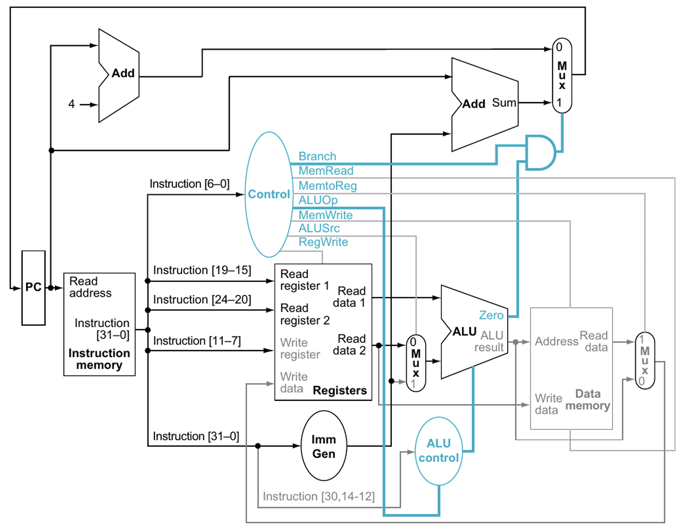

# RISCV-v2

## Overview 

### Harvard Architecture

    

Recall that the standard Harvard architecture looks like the above diagram. This is the model that we will follow for my **RISCV-v2 processor**, albeit with a few differences. For the previous rendition, it lacked multi-stage pipelining, hazard detection, any tangible way to interface with other peripheral devices, and it wasn't programmable, meaning that instructions had to be pre-loaded and synthesized as BRAM, making the design extremely unmodular. 

---

## Design Process

### Peripherals + Memory Mapped I/O

### Cache Architecture 

For the specific I-caches and D-caches in this processor, I will be implementing a direct-mapped cache hierarchy with a writeback policy. 

---

## Verification (UVM)

This project will be tested under UVM as two different systems: the RISC-V standalone core and the bootloader system. 

### RISC-V Core

### Bootloader

---

Thanks for stopping by!
