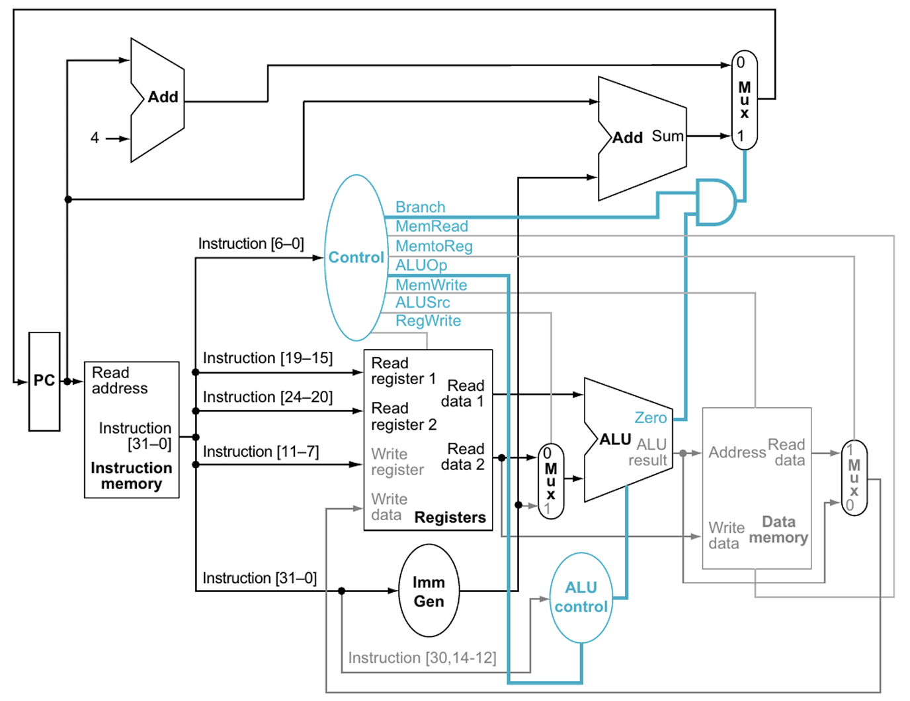

# RISCV-v2

A 5-stage pipelined RV32I processor in SystemVerilog, with split L1 instruction/data caches,
hazard detection and forwarding, and a formal + simulation verification flow spanning individual
modules up through full-program execution.

Successor to a single-cycle v1 core built during an earlier internship; this iteration is the
"engineering completeness" pass — real hazard handling, real memory hierarchy, and a real path
from source to FPGA bitstream, not just a working datapath.

---

## Key Features

- **ISA**: RV32I base integer instruction set
- **Pipeline**: 5-stage (IF / ID / EX / MEM / WB)
- **Hazard handling**: dedicated hazard detection unit covering fetch stalls, load-use stalls, and
  D-cache miss stalls as a totally ordered freeze-set chain, plus forwarding to minimize stall
  cycles
- **Memory hierarchy**: direct-mapped I-cache (writeback, sequential access pattern), 2-way
  set-associative D-cache with LRU replacement
- **Peripherals** *(in progress)*: Wishbone interconnect with master/slave wrappers currently being
  written; bootloader, UART GPIO, SPI GPIO, timer peripheral, and RAM
- **Verified two ways**: formal verification (SymbiYosys/BMC) for individual modules with large,
  provable input spaces; Icarus-based simulation for full-CPU, multi-cycle, program-level behavior
  — see [Verification](#verification) below
- **Toolchain**: bare-metal C firmware with volatile-typed MMIO, custom linker script and startup
  assembly (`bare_metal/`), targeting this core directly rather than staying in simulation-only
- **Timing analysis**: static timing analysis in progress for the CPU core (`timing_analysis`)

---

## Repository Structure

```
RISCV-v2/
├── bare_metal/                    # bare-metal C firmware, assembly, linker scripts
├── images/                        # diagrams referenced in this README
├── python_scripts/
│   ├── riscv_asm.py               # assembler: RISC-V instructions -> binaries for testbenching
│   └── firmware.py                # what I plan on using for transmitting code serially
├── rtl_design/                    # raw Verilog without the SVAs / testbench infrastructure
├── timing_analysis/               # static timing analysis through Xilinx and Sky130nm
├── verification/
│   ├── formal_verification/       # SymbiYosys/BMC proofs for individual modules (start here: core_formal/alu)
│   └── verilog_simulations/       # full-CPU RTL source + Icarus testbenches 
├── constraints.xdc                # synthesis timing constraints
└── README.md                      # project summary + overview
```

---

## Overview

### Harvard Architecture

<p align="center">
    
</p>

*Credit: Patterson & Hennessy, [Computer Organization and Design: RISC-V Edition](https://www.elsevier.com/books/computer-organization-and-design-risc-v-edition/patterson/978-0-12-812275-4)*

This is the model followed for **RISCV-v2**, with a few differences from the textbook diagram. The
previous iteration (v1) lacked multi-stage pipelining, hazard detection, any tangible way to
interface with peripheral devices, and wasn't programmable — instructions had to be pre-loaded and
synthesized as BRAM, making the design extremely unmodular and prone to data hazards with no
pipelining to speak of.

This iteration adds a hazard detection unit to catch those hazards, and aims to increase
performance through multi-stage pipelining, forwarding/branch units, and two separate L1 caches
for instructions and data.

---

## Design Process

### Cache Architecture

For the I-cache and D-cache in this processor, I implemented a direct-mapped cache with a writeback
policy for the I-cache, given its sequential access pattern. For the D-cache, I chose a 2-way
set-associative architecture with an LRU policy.

### Processor Architecture

Much like the old processor, but with instruction memory and data memory moved outside the
processor itself, so the core only encapsulates:

- Program Counter
- Register File
- Control Unit
- Arithmetic Logic Unit
- Branching Unit
- Forwarding Unit
- Hazard Detection Unit
- Immediate Generator
- Pipelining Registers

RTL source and the full-CPU testbenches both live under
`verification/simulation_testbenches/` — module-level testbenches aren't kept separately there;
that folder's testbench targets the whole CPU, not individual units. Individual-module correctness
is instead handled formally, under `verification/formal_verification/`.

---

## Verification

Two complementary strategies, not one:

- **[`verification/formal_verification/`](verification/formal_verification/README.md)** — formal
  proofs (SymbiYosys + BMC) for individual modules where the input space is large but the logic is
  tractable enough to prove exhaustively. Includes the ALU (`core_formal/alu`, complete, with a
  documented case study of distinguishing a real RTL bug from a Yosys tooling artifact) and the
  AXI-Lite master/slave wrappers (`core_formal/axi`, in progress alongside the interconnect itself).
- **[`verification/simulation_testbenches/`](verification/simulation_testbenches/README.md)** —
  Icarus Verilog testbenches for full-CPU, multi-cycle, program-level behavior that formal doesn't
  cover well (running real RISC-V programs, checking pipeline behavior over hundreds of cycles).

Each folder's README explains why that approach was chosen for that scope, and how to reproduce the
results.

---

## Status / Roadmap

- [x] 5-stage pipeline, hazard detection, forwarding
- [x] Split L1 I/D caches (direct-mapped I, 2-way set-associative D)
- [x] Bare-metal C toolchain (linker script, startup assembly, MMIO)
- [x] Formal verification of individual modules (ALU complete)
- [ ] Wishbone interconnect (master/slave wrappers) — in progress
- [ ] UART + SPI peripherals
- [ ] UART bootloader
- [ ] Static timing analysis (CPU + AXI-Lite)
- [ ] IPC / performance characterization on real workloads

---

## Credits + References

### Diagrams and Figures

- **Harvard Architecture Overview**: Based on the classic 5-stage RISC pipeline diagram from
  Patterson, D.A. and Hennessy, J.L. (2017).
- **Cache Associativity Diagrams**:
  [CS Illustrated](https://csillustrated.berkeley.edu/PDFs/handouts/cache-3-associativity-handout.pdf),
  UC Berkeley EECS Department

---

Thanks for stopping by!