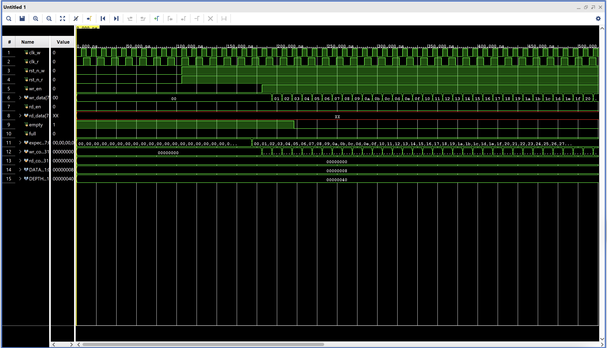

# Asynchronous FIFO

<p align="center">
    
</p>


## Purpose

The asynchronous FIFO is one of the most common interview points when it comes to RTL design. When you do communication across multiple systems with different independent clocks, it is necessary to understand how to handle data transfers safely through clock domain crossings.

Signal Specifications:
* `clk_w`, `clk_r`: read and write clock signals for dual port access
* `rst_n_w`, `rst_n_r`: active low resets for both reads and writes
* `wr_en`, `rd_en`: enable pins
* `wr_data`, `rd_data`: write and read data
* `empty`, `full`: status flags

---

## RTL Code

Here's my RTL code for my asynchronous FIFO in the bootloader module:

```Verilog
`timescale 1ns / 1ps

module async_fifo #(
    parameter DATA_WIDTH = 8,
    parameter DEPTH = 64
) (
    // write interface (uart clock domain)
    input  logic clk_w,
    input  logic rst_n_w,
    input  logic wr_en,
    input  logic [DATA_WIDTH-1:0] wr_data,
    
    // read interface (CPU clock domain)
    input  logic clk_r,
    input  logic rst_n_r,
    input  logic rd_en,
    output logic [DATA_WIDTH-1:0] rd_data,
    
    // status flags
    output logic empty,
    output logic full
);

    localparam ADDR_WIDTH = $clog2(DEPTH);
    localparam PTR_WIDTH = ADDR_WIDTH + 1;  // +1 for full/empty distinction
    
    // dual-port memory
    logic [DATA_WIDTH-1:0] mem [0:DEPTH-1];
    
    // binary pointers
    logic [PTR_WIDTH-1:0] rd_ptr_bin, wr_ptr_bin;
    
    // gray code pointers
    logic [PTR_WIDTH-1:0] rd_ptr_gray, wr_ptr_gray;
    
    // synchronized gray pointers
    logic [PTR_WIDTH-1:0] rd_ptr_gray_sync1, rd_ptr_gray_sync2;
    logic [PTR_WIDTH-1:0] wr_ptr_gray_sync1, wr_ptr_gray_sync2;
    
    // convert binary to gray code
    assign rd_ptr_gray = rd_ptr_bin ^ (rd_ptr_bin >> 1);
    assign wr_ptr_gray = wr_ptr_bin ^ (wr_ptr_bin >> 1);
    
    // read pointer equals synchronized write pointer (in read domain)
    assign empty = (rd_ptr_gray == wr_ptr_gray_sync2);
    
    // write pointer equals synchronized read pointer with MSB inverted
    assign full = (wr_ptr_gray == {~rd_ptr_gray_sync2[PTR_WIDTH-1:PTR_WIDTH-2],
                                    rd_ptr_gray_sync2[PTR_WIDTH-3:0]});
    
    // synchronize read pointer to write domain (2-stage synchronizer)
    always_ff @(posedge clk_w or negedge rst_n_w) begin
        if (!rst_n_w) begin
            rd_ptr_gray_sync1 <= '0;
            rd_ptr_gray_sync2 <= '0;
        end else begin
            rd_ptr_gray_sync1 <= rd_ptr_gray;
            rd_ptr_gray_sync2 <= rd_ptr_gray_sync1;
        end
    end
    
    // synchronize write pointer to read domain (2-stage synchronizer)
    always_ff @(posedge clk_r or negedge rst_n_r) begin
        if (!rst_n_r) begin
            wr_ptr_gray_sync1 <= '0;
            wr_ptr_gray_sync2 <= '0;
        end else begin
            wr_ptr_gray_sync1 <= wr_ptr_gray;
            wr_ptr_gray_sync2 <= wr_ptr_gray_sync1;
        end
    end
    
    // write logic (in write clock domain)
    always_ff @(posedge clk_w) begin
        if (wr_en && !full) begin
            mem[wr_ptr_bin[ADDR_WIDTH-1:0]] <= wr_data;
        end
    end
    
    always_ff @(posedge clk_w or negedge rst_n_w) begin
        if (!rst_n_w) begin
            wr_ptr_bin <= '0;
        end else if (wr_en && !full) begin
            wr_ptr_bin <= wr_ptr_bin + 1'b1;
        end
    end
    
    // read logic (in read clock domain)
    always_ff @(posedge clk_r) begin
        if (rd_en && !empty) begin
            rd_data <= mem[rd_ptr_bin[ADDR_WIDTH-1:0]];
        end
    end
    
    always_ff @(posedge clk_r or negedge rst_n_r) begin
        if (!rst_n_r) begin
            rd_ptr_bin <= '0;
        end else if (rd_en && !empty) begin
            rd_ptr_bin <= rd_ptr_bin + 1'b1;
        end
    end

endmodule
```

---

## Simulation + Waveform

The testbench is in this folder, and it ensures that the asynchronous FIFO does not allow writes when it's full nor does it allow reads when it's empty. Here's the waveform:

<p align="center">
    
</p>

You can check the RTL code, where it contains two helper functions to automate the write until full and read until empty processes. The waveform is quite long here, but you can simulate for yourself using my code in this directory.

---