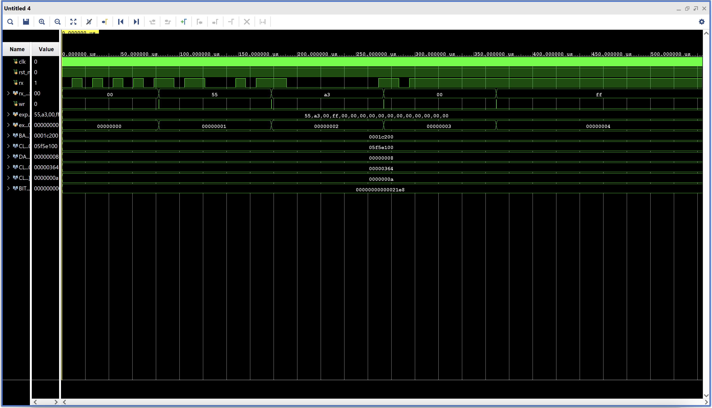

# UART Receiver

## Purpose

The `uart_rx` module is responsible for interfacing with the serial port from my Mac. This makes it so that writes to the instruction memory are now possible through serial communication.

### Waveform Diagram of `rx` and `tx` Channels

### State Machine Diagram

---

## RTL Code

```Verilog
`timescale 1ns / 1ps

module uart_rx # (
    parameter BAUD_RATE = 115200,
    parameter DATA_WIDTH = 8,
    parameter CLK_FREQ = 100_000_000
) (
    input  logic clk,
    input  logic rst_n,
    input  logic rx,
    output logic [DATA_WIDTH-1:0] rx_data,
    output logic wr
);

    // calculate clock divider values
    localparam int CLKS_PER_BIT = CLK_FREQ / BAUD_RATE;
    localparam int CLKS_PER_HALF_BIT = CLKS_PER_BIT / 2;
    
    typedef enum logic [2:0] {
        IDLE  = 3'b000,
        START = 3'b001,
        DATA  = 3'b010,
        STOP  = 3'b011
    } rx_state_t;

    rx_state_t state, next_state;
    
    logic [15:0] clk_count;
    logic [2:0] bit_index;
    logic [DATA_WIDTH-1:0] rx_data_reg;
    
    // use a double flop to synchronize data
    logic rx_sync1, rx_sync2;
    always_ff @(posedge clk or negedge rst_n) begin
        if (!rst_n) begin
            rx_sync1 <= 1'b1;
            rx_sync2 <= 1'b1;
        end else begin
            rx_sync1 <= rx;
            rx_sync2 <= rx_sync1;
        end
    end
    
    // state register
    always_comb begin
        if (!rst_n)
            state <= IDLE;
        else
            state <= next_state;
    end
    
    // logic for fsm
    always_ff @(posedge clk or negedge rst_n) begin
        if (!rst_n) begin
            clk_count <= 0;
            bit_index <= 0;
            rx_data_reg <= 0;
            rx_data <= 0;
            wr <= 1'b0;
        end else begin
            next_state <= state;
            wr <= 1'b0;  // default: don't write
            
            case (state)
                IDLE: begin
                    clk_count <= 0;
                    bit_index <= 0;
                    if (!rx_sync2) begin  // detected start bit (falling edge)
                        next_state <= START;
                    end else begin
                        next_state <= IDLE;
                    end
                end
                
                START: begin
                    // wait until middle of start bit to verify it's still low
                    if (clk_count < CLKS_PER_HALF_BIT - 1) begin
                        clk_count <= clk_count + 1;
                        next_state <= START;
                    end else begin
                        clk_count <= 0;
                        if (!rx_sync2) begin
                            next_state <= DATA;  // valid start bit
                        end else begin
                            next_state <= IDLE;  // false start (glitch)
                        end
                    end
                end
                
                DATA: begin
                    if (clk_count < CLKS_PER_BIT - 1) begin
                        clk_count <= clk_count + 1;
                        next_state <= DATA;
                    end else begin
                        clk_count <= 0;
                        rx_data_reg[bit_index] <= rx_sync2;  // sample at bit center
                        
                        if (bit_index < DATA_WIDTH - 1) begin
                            bit_index <= bit_index + 1;
                            next_state <= DATA;
                        end else begin
                            bit_index <= 0;
                            next_state <= STOP;
                        end
                    end
                end
                
                STOP: begin
                    if (clk_count < CLKS_PER_BIT - 1) begin
                        clk_count <= clk_count + 1;
                        next_state <= STOP;
                    end else begin
                        clk_count <= 0;
                        if (rx_sync2) begin  // valid stop bit (should be high)
                            rx_data <= rx_data_reg;
                            wr <= 1'b1;
                            next_state <= IDLE;
                        end else begin
                            next_state <= IDLE;
                        end
                    end
                end
                
                default: next_state <= IDLE;
            endcase
        end
    end

endmodule
```

---

## Simulation + Waveform

<p align="center">
    
</p>

Here, you can see the RX signal toggling up and down, and `rx_data` is actually updating correctly right after each stop bit.
Download both the `uart_rx.sv` and `uart_rx_tb.sv` and run the simulations (run on 1ms) to view the waveforms in closer detail.


---