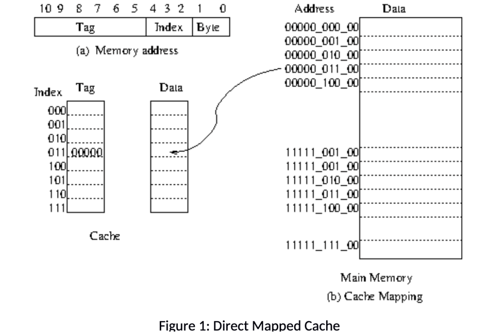

# Caches

## Purpose

Caches act as fast memory access for the CPU, lowering CPI and increasing overall CPU performance. For the purposes of this single core processor with external peripherals, I implemented two separate L1 caches for the instruction memory and data memory modules.

### Different Cache Archetypes

* Direct Mapped Cache
<p align="center">
    
</p>

Direct mapped caches are 

* N-way Set Associative

* Fully Set Associative

### Diferent Policies

* Write-Through Policy

* Write-Back Policy

* Write-Around Policy

### Design Decision

---

## RTL Code

This is the RTL implementation of the instruction cache in SystemVerilog:

```Verilog
`timescale 1ns / 1ps

// this will be a 1kB cache
module instr_cache # (
    parameter DEPTH = 256
)(
    input logic clk,
    input logic rst_n,
    
    // interfaces with RISC-V core
    input logic[31:0] cpu_addr, 
    input logic cpu_req, 
    output logic[31:0] cpu_rdata,
    output logic cpu_ready,

    // interfaces with instr_memory
    output logic[31:0] mem_addr, 
    output logic mem_req,
    input logic[31:0] mem_rdata,
    input logic mem_ready
);

    logic[21:0] tag_ram [0:63];
    logic valid_ram [0:63];
    logic[31:0] cache_ram [0:63][0:3];

    // address breakdown
    logic [21:0] addr_tag;
    logic [5:0]  addr_index;
    logic [1:0]  addr_offset;

    assign addr_tag    = cpu_addr[31:10];  
    assign addr_index  = cpu_addr[9:4];   
    assign addr_offset = cpu_addr[3:2];

    // hit detection logic
    logic [21:0] stored_tag;
    logic stored_valid;
    logic hit;

    assign stored_tag = tag_ram[addr_index];
    assign stored_valid = valid_ram[addr_index];
    assign hit = (addr_tag == stored_tag) && stored_valid;

    // defined state machine for IDLE and REFILL
    typedef enum logic [1:0] {
        IDLE,
        REFILL
    } state_t;
    
    state_t state;
    logic [1:0] refill_count;

    always_ff @(posedge clk or negedge rst_n) begin
        if (!rst_n) begin
            state <= IDLE;
            refill_count <= 0;
            for (int i = 0; i < 64; i++) begin
                valid_ram[i] <= 0;
            end
        end else begin
            case (state)
                IDLE: begin
                    // if CPU requests an instruction
                    // and we have a cache miss
                    if (cpu_req && !hit) begin
                        state <= REFILL; // start refilling
                        refill_count <= 0;
                    end
                end
                
                REFILL: begin
                    if (mem_ready) begin
                        cache_ram[addr_index][refill_count] <= mem_rdata;
                        
                        if (refill_count == 3) begin
                            tag_ram[addr_index] <= addr_tag;
                            valid_ram[addr_index] <= 1;
                            state <= IDLE;
                        end else begin
                            refill_count <= refill_count + 1;
                        end
                    end
                end
            endcase
        end
    end

    // memory interface
    assign mem_req = (state == REFILL);
    assign mem_addr = {addr_tag, addr_index, refill_count, 2'b00};

    // outputs for CPU
    assign cpu_rdata = cache_ram[addr_index][addr_offset];
    assign cpu_ready = hit;

endmodule
```

This is the RTL implementation of the data cache in SystemVerilog using dirty flag bits:

```Verilog
```

---

## Simulation + Waveform

---