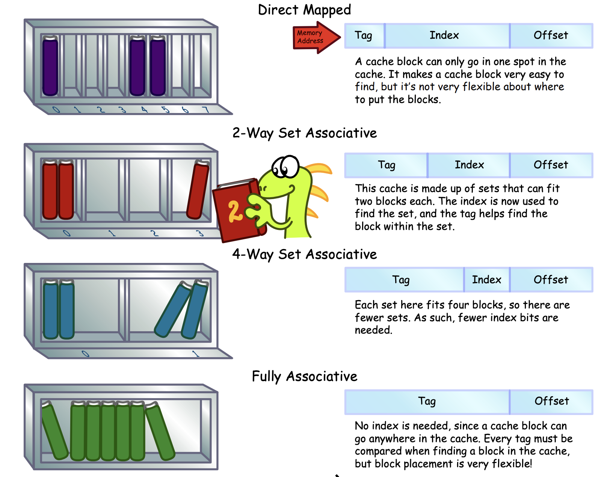

# L1 Caches (D-caches and I-caches)

<p align="center">
    
</p>

*Image source: [CS Illustrated: Cache Associativity](https://csillustrated.berkeley.edu/PDFs/handouts/cache-3-associativity-handout.pdf), UC Berkeley Computer Science Department*


## Purpose

Caches act as fast memory access for the CPU, lowering CPI and increasing overall CPU performance. For the purposes of this single core processor with external peripherals, I implemented two separate L1 caches for the instruction memory and data memory modules.

### Different Cache Archetypes

* Direct Mapped Cache (1-way Set Associative)
<p align="center">
    
</p>

* N-way Set Associative

* Fully Set Associative

### Diferent Policies

* Write-Through Policy

* Write-Back Policy

* Write-Around Policy

### Design Decision

---

## RTL Code

This is the RTL implementation of the instruction cache in SystemVerilog:

```Verilog
`timescale 1ns / 1ps

// this will be a 1kB cache
module instr_cache # (
    parameter DEPTH = 256
)(
    input logic clk,
    input logic rst_n,
    
    // interfaces with RISC-V core
    input logic[31:0] cpu_addr, 
    input logic cpu_req, 
    output logic[31:0] cpu_rdata,
    output logic cpu_ready,

    // interfaces with instr_memory
    output logic[31:0] mem_addr, 
    output logic mem_req,
    input logic[31:0] mem_rdata,
    input logic mem_ready
);

    logic[21:0] tag_ram [0:63];
    logic valid_ram [0:63];
    logic[31:0] cache_ram [0:63][0:3];

    // address breakdown
    logic [21:0] addr_tag;
    logic [5:0]  addr_index;
    logic [1:0]  addr_offset;

    assign addr_tag    = cpu_addr[31:10];  
    assign addr_index  = cpu_addr[9:4];   
    assign addr_offset = cpu_addr[3:2];

    // hit detection logic
    logic [21:0] stored_tag;
    logic stored_valid;
    logic hit;

    assign stored_tag = tag_ram[addr_index];
    assign stored_valid = valid_ram[addr_index];
    assign hit = (addr_tag == stored_tag) && stored_valid;

    // defined state machine for IDLE and REFILL
    typedef enum logic [1:0] {
        IDLE,
        REFILL
    } state_t;
    
    state_t state;
    logic [1:0] refill_count;

    always_ff @(posedge clk or negedge rst_n) begin
        if (!rst_n) begin
            state <= IDLE;
            refill_count <= 0;
            for (int i = 0; i < 64; i++) begin
                valid_ram[i] <= 0;
            end
        end else begin
            case (state)
                IDLE: begin
                    // if CPU requests an instruction
                    // and we have a cache miss
                    if (cpu_req && !hit) begin
                        state <= REFILL; // start refilling
                        refill_count <= 0;
                    end
                end
                
                REFILL: begin
                    if (mem_ready) begin
                        cache_ram[addr_index][refill_count] <= mem_rdata;
                        
                        if (refill_count == 3) begin
                            tag_ram[addr_index] <= addr_tag;
                            valid_ram[addr_index] <= 1;
                            state <= IDLE;
                        end else begin
                            refill_count <= refill_count + 1;
                        end
                    end
                end
            endcase
        end
    end

    // memory interface
    assign mem_req = (state == REFILL);
    assign mem_addr = {addr_tag, addr_index, refill_count, 2'b00};

    // outputs for CPU
    assign cpu_rdata = cache_ram[addr_index][addr_offset];
    assign cpu_ready = hit;

endmodule
```

This is the RTL implementation of the data cache in SystemVerilog using dirty flag bits:

```Verilog
`timescale 1ns / 1ps

// this will be a 2-way set associative cache
module data_cache # (
    parameter CACHE_SIZE = 4096,
    parameter BLOCK_SIZE = 16,
    parameter ADDR_WIDTH = 32,
    parameter DATA_WIDTH = 32,
    parameter NUM_WAYS = 2
) (
    input logic clk,
    input logic rst_n,
    input logic [ADDR_WIDTH-1:0] addr,
    input logic [DATA_WIDTH-1:0] wr_data,
    input logic rd_en,
    input logic wr_en,
    output logic [DATA_WIDTH-1:0] rd_data,
    output logic ready,
    
    // memory interface
    output logic [ADDR_WIDTH-1:0] mem_addr,
    output logic [DATA_WIDTH-1:0] mem_wr_data,
    output logic mem_rd_en,
    output logic mem_wr_en,
    input logic [DATA_WIDTH-1:0] mem_rd_data,
    input logic mem_ready
);

    localparam BLOCK_WORDS = BLOCK_SIZE / 4;
    localparam TOTAL_BLOCKS = CACHE_SIZE / BLOCK_SIZE;  // 256 total blocks
    localparam NUM_SETS = TOTAL_BLOCKS / NUM_WAYS;  // 128 sets, 2 ways each
    localparam SET_INDEX_BITS = $clog2(NUM_SETS); // 7 bits
    localparam OFFSET_BITS = $clog2(BLOCK_SIZE); // 4 bits
    localparam TAG_BITS = ADDR_WIDTH - SET_INDEX_BITS - OFFSET_BITS;  // 21 bits
    
    logic [TAG_BITS-1:0] tag;
    logic [SET_INDEX_BITS-1:0] set_index; 
    logic [OFFSET_BITS-1:0] offset;
    logic [1:0] word_offset;
    
    assign tag = addr[ADDR_WIDTH-1:SET_INDEX_BITS+OFFSET_BITS];
    assign set_index = addr[SET_INDEX_BITS+OFFSET_BITS-1:OFFSET_BITS];
    assign offset = addr[OFFSET_BITS-1:0];
    assign word_offset = offset[OFFSET_BITS-1:2];
    
    // cache storage
    logic [DATA_WIDTH-1:0] data_array [NUM_SETS-1:0][NUM_WAYS-1:0][BLOCK_WORDS-1:0];
    logic [TAG_BITS-1:0] tag_array [NUM_SETS-1:0][NUM_WAYS-1:0];
    logic valid_array [NUM_SETS-1:0][NUM_WAYS-1:0];
    logic dirty_array [NUM_SETS-1:0][NUM_WAYS-1:0];
    
    // LRU bits (replacement policy here)
    // for a 2-way: 1 bit per set (0=use way0, 1=use way1)
    logic lru_array [NUM_SETS-1:0];
    
    // tag comparison (check both ways)
    logic hit_way0, hit_way1;
    logic hit;
    logic hit_way;  // which way hit (0 or 1)
    
    assign hit_way0 = valid_array[set_index][0] && (tag_array[set_index][0] == tag);
    assign hit_way1 = valid_array[set_index][1] && (tag_array[set_index][1] == tag);
    assign hit = hit_way0 || hit_way1;
    assign hit_way = hit_way1 ? 1'b1 : 1'b0;  
    
    logic [DATA_WIDTH-1:0] cache_data;
    assign cache_data = hit_way0 ? data_array[set_index][0][word_offset] :
                                    data_array[set_index][1][word_offset];
    
    // replacement policy: LRU
    logic replace_way;  // which way to replace on miss
    
    always_comb begin
        if (!valid_array[set_index][0]) begin
            replace_way = 1'b0;  // way 0 is invalid, use it
        end else if (!valid_array[set_index][1]) begin
            replace_way = 1'b1;  // way 1 is invalid, use it
        end else begin
            replace_way = lru_array[set_index];  // both valid, use LRU
        end
    end
    
    typedef enum logic [2:0] {
        IDLE,
        WRITE_BACK,
        ALLOCATE_READ,
        ALLOCATE_WAIT,
        READY_STATE
    } cache_state_t;
    
    cache_state_t state, next_state;
    logic [1:0] word_counter;
    logic [0:0] current_way;
    
    always_ff @(posedge clk or negedge rst_n) begin
        if (!rst_n) begin
            state <= IDLE;
            ready <= 1'b0;
            
            // initialize
            for (int i = 0; i < NUM_SETS; i++) begin
                for (int j = 0; j < NUM_WAYS; j++) begin
                    valid_array[i][j] <= 1'b0;
                    dirty_array[i][j] <= 1'b0;
                end
                lru_array[i] <= 1'b0;
            end
        end else begin
            state <= next_state;
            
            case (state)
                IDLE: begin
                    ready <= 1'b0;
                    
                    if (rd_en || wr_en) begin
                        if (hit) begin
                            // cache hit!
                            current_way <= hit_way;
                            
                            if (wr_en) begin
                                data_array[set_index][hit_way][word_offset] <= wr_data;
                                dirty_array[set_index][hit_way] <= 1'b1;
                            end
                            
                            rd_data <= cache_data;
                            ready <= 1'b1;
                            
                            // update the LRU
                            lru_array[set_index] <= ~hit_way; // next time, use other way
                            
                            next_state <= READY_STATE;
                        end else begin
                            // cache miss!
                            current_way <= replace_way;
                            
                            if (valid_array[set_index][replace_way] && 
                                dirty_array[set_index][replace_way]) begin
                                // need writeback
                                next_state <= WRITE_BACK;
                                word_counter <= 0;
                            end else begin
                                // can allocate directly
                                next_state <= ALLOCATE_READ;
                                word_counter <= 0;
                            end
                        end
                    end
                end
                
                WRITE_BACK: begin
                    mem_wr_en <= 1'b1;
                    mem_addr <= {tag_array[set_index][current_way], 
                                 set_index, word_counter, 2'b00};
                    mem_wr_data <= data_array[set_index][current_way][word_counter];
                    
                    if (mem_ready) begin
                        if (word_counter == BLOCK_WORDS - 1) begin
                            dirty_array[set_index][current_way] <= 1'b0;
                            next_state <= ALLOCATE_READ;
                            word_counter <= 0;
                        end else begin
                            word_counter <= word_counter + 1;
                        end
                    end
                end
                
                ALLOCATE_READ: begin
                    mem_rd_en <= 1'b1;
                    mem_addr <= {tag, set_index, word_counter, 2'b00};
                    
                    if (mem_ready) begin
                        data_array[set_index][current_way][word_counter] <= mem_rd_data;
                        
                        if (word_counter == BLOCK_WORDS - 1) begin
                            tag_array[set_index][current_way] <= tag;
                            valid_array[set_index][current_way] <= 1'b1;
                            dirty_array[set_index][current_way] <= 1'b0;
                            
                            // handle original request
                            if (wr_en) begin
                                data_array[set_index][current_way][word_offset] <= wr_data;
                                dirty_array[set_index][current_way] <= 1'b1;
                            end
                            
                            rd_data <= (wr_en) ? wr_data : 
                                       data_array[set_index][current_way][word_offset];
                            ready <= 1'b1;
                            
                            // update the LRU
                            lru_array[set_index] <= ~current_way;
                            
                            next_state <= READY_STATE;
                        end else begin
                            word_counter <= word_counter + 1;
                        end
                    end
                end
                
                READY_STATE: begin
                    ready <= 1'b0;
                    next_state <= IDLE;
                end
            endcase
        end
    end

endmodule
```

---

## Simulation + Waveform

---